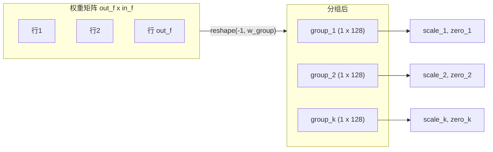
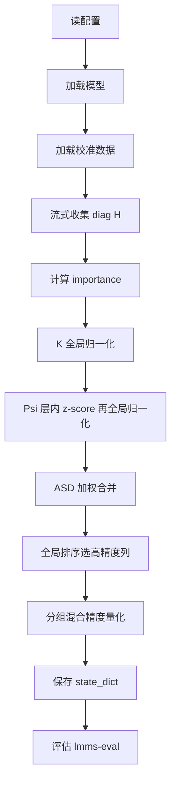

# ASD 与混合精度共识（与实现对照）

本文档整理对话共识，并对照 ASDQ 代码说明已实现部分与使用方式。

---

## 0. 分组共识

- **一个 group 是什么**：**一行 × 一坨列**。  
  权重矩阵形状 `(out_features, in_features)`，例如 `w_group=128` 时，把矩阵按**行**切成很多段，每段是**同一行上的 128 个连续列**，即形状上是一块 **(1, 128)**。也就是说，每组是「同一行上的连续 `w_group` 列」，不是按列切块。
- **量化参数**：每个 group 有**自己**的 scale / zero_point；不同 group 的量化参数不同，组与组之间独立。

**分组方式示意**：权重按行展平后按 `w_group` 列切块：



**代码对应**：`pseudo_quantize_tensor` 里 `tensor.reshape(-1, q_group_size)` 把权重拉成 `(out_f * in_f / w_group, w_group)`，**每一行就是一个 group**，即形状上每块是 (1, 128)。

---

## 1. ASD 公式

\[
\text{ASD}_c = \theta_1 \cdot K_c + \theta_2 \cdot \Psi_c
\]

对**每个输入通道 c** 算一个 ASD 值；ASD 用于**全局**排序（所有层、所有通道一起比）。ASD 越高的通道，在量化时将其对应**权重列**保留为原始 float 精度，其余列量化为低比特。

- **θ1**（默认 0.8）：K 的权重，表示「绝对重要性」的占比；K 越大表示该通道对输出/损失的贡献越大。
- **θ2**（默认 0.2）：Ψ 的权重，表示「层内相对突出度」的占比；Ψ 越大表示该通道在同层内越异常、越值得保留。
- θ1、θ2 可在 `configs/default.yaml` 中配置；建议 θ1 为主、θ2 为辅。详见 README 配置说明。

---

## 2. K：绝对显著性（Hessian-based importance）

### 定义

\[
\text{importance}_c = \|W[:,c]\|^2 \times \text{diag}(H)_c
\]

其中：
- \(\|W[:,c]\|^2\)：权重第 c 列的平方和（层对该通道的依赖程度）
- \(\text{diag}(H)_c = E[x_c^2]\)：Hessian 对角线（该通道激活的二阶矩）

### 数学证明（OBS 思路）

损失对权重的二阶近似（Optimal Brain Surgeon / 二阶泰勒）：

\[
L(w + \delta w) \approx L(w) + g^T \delta w + \frac{1}{2} \delta w^T H \delta w
\]

若**只扰动第 c 列**，即 \(\delta w\) 仅在列 c 非零，则二次项为（记 \(\delta W_{:,c}\) 为第 c 列的扰动）：

\[
\frac{1}{2} \delta w^T H \delta w = \frac{1}{2} \sum_{i,j} (H)_{i,j} (\delta w)_i (\delta w)_j
\]

对线性层 \(y = Wx\)，损失对**输入**的 Hessian 在常见假设下满足 \((H)_{c,c} \propto E[x_c^2]\)；且仅第 c 列有扰动时，交叉项与列 c 的自项相比可忽略，故：

\[
\Delta L_c \propto \frac{1}{2} \|\delta W_{:,c}\|^2 \cdot (H)_{c,c} \propto \|\delta W_{:,c}\|^2 \cdot E[x_c^2]
\]

在「round-to-nearest」量化假设下，扰动大小与权重大小同量级：\(\|\delta W_{:,c}\|^2 \propto \|W_{:,c}\|^2\)，因此：

\[
\boxed{\text{importance}_c = \|W[:,c]\|^2 \times E[x_c^2]}
\]

即 **importance_c** 度量的是「量化第 c 列权重对损失增量的贡献」，单位一致，**跨层可比**。

### 跨层可比性

importance 度量的是「对损失/输出方差的贡献」，不同层的值同一物理单位，可直接全局比较。

### 归一化

\[
K_{\text{normalized}} = \frac{\text{importance}}{\text{global\_max}}
\]

对全模型所有通道的 importance 做一次全局归一化，使其落入 [0, 1]。

**代码**：`asdq/metrics/asd.py` → `compute_importance(weight, diag_H)`

---

## 3. Ψ：相对显著性（层内 z-score）

### 定义

\[
\Psi_c = \max\left(0,\; \frac{\text{importance}_c - \mu_{\text{layer}}}{\sigma_{\text{layer}}}\right)
\]

其中 \(\mu_{\text{layer}}\)、\(\sigma_{\text{layer}}\) 为该层所有通道 importance 的均值和标准差。

### 含义

衡量「该通道在同层内有多突出」：z-score 表示偏离层均值几个标准差；负值置 0 表示低于均值即不突出，不参与加分。

### 归一化

\[
\Psi_{\text{normalized}} = \frac{\Psi}{\text{global\_max\_}\Psi}
\]

对所有层的 Ψ 再做一次全局归一化，使 Ψ 落入 [0, 1]，与 K_normalized 同尺度后加权合并为 ASD。

**代码**：`asdq/metrics/asd.py` → `compute_Psi(importance, method="zscore")`

---

## 4. 流式 Hessian 对角收集

### 问题

若存储原始激活 \(x \in \mathbb{R}^{N \times C}\)，显存为 O(层数 × N × C)，大模型易 OOM。

### 数学关系

对线性层 \(y = Wx\)，损失对输入的 Hessian 在 MSE 等常见损失下，其对角线满足 \(\text{diag}(H)_c \propto E[x_c^2]\)。流式只需估计每个通道的二次矩：

\[
\text{diag}(H)_c \approx \frac{1}{N_{\text{tokens}}} \sum_n x_{n,c}^2 = E[x_c^2]
\]

### 方案

流式累加，不存整块激活：

```python
sum_x2[key] += x.pow(2).sum(dim=0)   # shape [C]
count[key] += N_tokens
# 最终: diag_H = sum_x2 / count
```

显存从 O(层数 × N × C) 降为 **O(层数 × C)**。

### 与 OWQ/GPTQ 的关系

OWQ 的 `add_batch` 计算完整 Hessian 矩阵 H (C×C)；我们只用到对角线，\(\text{diag}(X X^\top)_c = \sum_n x_{n,c}^2\)，跳过非对角，内存从 O(C²) 降到 O(C)。

**代码**：`asdq/calibration/hessian_collector.py` → `collect_hessian_diag(...)`

---

## 5. 混合精度

### 原则

ASD 全局排序后，取前 `asd_high_precision_ratio`（默认 0.1）的通道，将其对应**权重列**保留为原始 float；其余列量化为 `asd_low_w_bit`（默认 4-bit）。所有层、所有通道一起排序，取全局 top 比例，不是每层各自 10%。

### 分组做法

- **分组方式**：权重矩阵按**行**切块，每块是**一行 × w_group 列**（如 128 列），即一个 group；每组有自己的一组 scale / zero_point。代码上：`tensor.reshape(-1, q_group_size)` 把权重拉成 `(out_f * in_f / w_group, w_group)`，每一行就是一个 group。
- **组内高精度列**：若某列被选为高精度列，组内处理时：先用该行**非高精度位置**的均值填充这些高精度位置，用填充后的整组拟合 scale/zero 并做量化→反量化，再把高精度列位置写回原始 float，得到「量化部分 + 高精度列」的合并权重，推理时直接一次 matmul。
- 我们借鉴了 SpQR 中「分组 + 组内对 outlier 的处理」思路，在此不展开其步步细节。

单组内处理流程可概括为：


### 特殊情况

某行某 group 内全是高精度列时，整段不量化，视为保留精度（极罕见）。

**代码**：
- `asdq/quantization/quant_funcs.py` → `pseudo_quantize_weight_spqr_style`
- `asdq/quantization/quantize.py` → `pseudo_quantize_model_weight`

---

## 6. 全流程

端到端流程：



| 阶段 | 操作 | 代码 |
|------|------|------|
| 准备 | 读配置 + 加载模型 | `main_quant.py` |
| 校准数据 | 加载 COCO 格式数据 | `asdq/calibration/coco_vl.py` |
| 收集 Hessian 对角 | 前向钩子流式累加 E[x_c²] | `asdq/calibration/hessian_collector.py` |
| 计算 ASD | importance → K(全局归一化) + Psi(层内z-score) → ASD | `asdq/metrics/asd.py` + `asdq/quantization/mixed_precision.py` |
| 选择高精度列 | 全局排序取 top ratio | `mixed_precision.select_high_precision_columns` |
| 分组混合精度量化 | 分组内填充高精度位 → scale/zero → 量化 → 写回高精度列 | `asdq/quantization/quantize.py` |
| 保存 | 合并后 float 权重存 state_dict | `main_quant.py` |
| 评估 | 加载 scale_path 跑 lmms-eval | `main_eval.py` |

---

## 7. 配置项

与 `configs/default.yaml` 一致；**完整参数说明见 README「YAML 全参数说明」**。此处仅列出与 ASD/混合精度/量化直接相关的项：

```yaml
# ASD 参数
asd_theta1: 0.8              # K（绝对显著性）的权重
asd_theta2: 0.2              # Psi（相对显著性）的权重
asd_normalize: true           # 归一化 K/Psi 到 [0,1]

# 混合精度
asd_mixed_precision: true     # 是否启用（默认启用）
asd_high_precision_ratio: 0.1 # 全局保留精度比例
asd_low_w_bit: 4              # 非高精度列的量化比特

# 量化
w_bit: 4                      # 统一量化比特（mixed_precision=false 时用）
w_group: 128                  # 分组大小：一行×w_group 列为一组
```

层 key 约定：校准与量化统一使用 `layers.{block_idx}.{linear_name}`。

---

## 8. 归一化总结

| 归一化 | 对谁做 | 次数 | 作用 |
|--------|--------|------|------|
| K 全局归一化 | importance / global_max | 1 次全局 | 不同层的绝对重要性可比，落入 [0,1] |
| Psi z-score | (importance − 层均值) / 层标准差 | 每层 1 次 | 衡量层内异常程度 |
| Psi 全局归一化 | Psi_raw / global_max_Psi | 1 次全局 | Psi 落入 [0,1]，与 K 可加权合并 |
